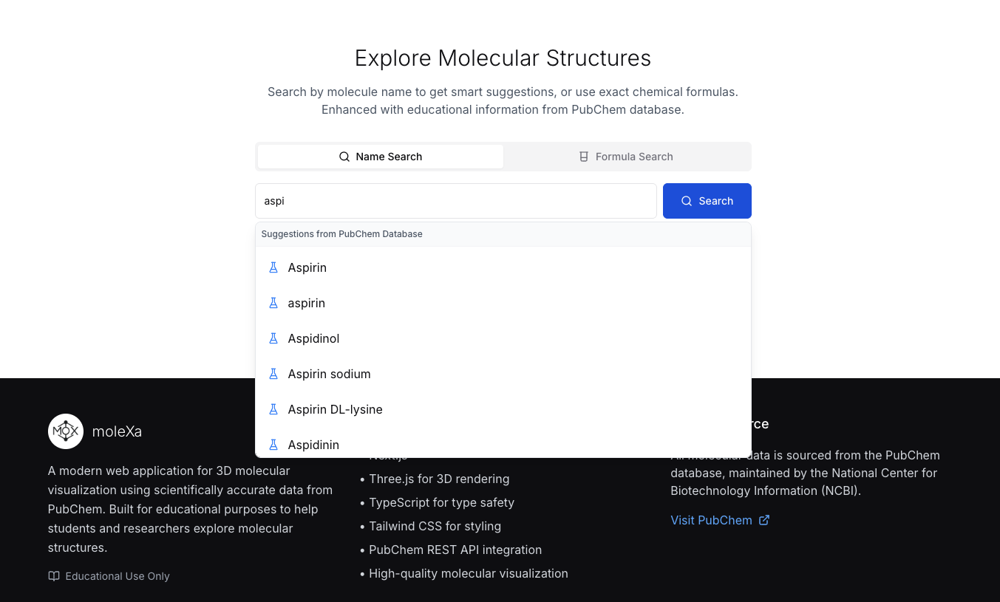

# moleXa: 3D Molecular Visualization Platform

<!-- Logo placeholder -->
<div align="center">
  
  
  [](https://github.com/bazarkua/molexa/stargazers)
  [](https://opensource.org/licenses/MIT)
  [](https://nextjs.org/)
  [](https://www.typescriptlang.org/)
  [](https://threejs.org/)
</div>

**moleXa** is a web application that makes it easy to explore and visualize molecules in 3D. Whether you're a student learning chemistry, a teacher looking for better ways to explain molecular structures, or just curious about the molecular world around us, this tool brings chemistry to life in your browser.

**Live Demo:** [molexa.org](https://molexa.org)  
**API Documentation:** [molexa-api.vercel.app/api/docs](https://molexa-api.vercel.app/api/docs)  
**Backend API:** [molexa-api repository](https://github.com/bazarkua/molexa-api)

---

## What moleXa Does

### Advanced 3D Visualization
- Shows molecules as they actually look with proper bonding and geometry
- You can rotate, zoom, and explore structures with your mouse
- Uses high-quality rendering so everything looks crisp and realistic
- Automatically converts 2D chemical data into 3D models
- Colors each element appropriately and sizes atoms correctly

### Built for Learning
- Provides detailed information about each molecule including safety data
- Smart search that suggests chemical names as you type
- Works with both chemical names and molecular formulas
- Includes educational explanations from trusted sources
- Shows safety and toxicity information for lab work

### Easy to Use
- Works great on phones, tablets, and computers
- Fetches data in real-time from PubChem's database
- Gives helpful error messages when something goes wrong
- Includes analytics to see how the tool is being used
- Lets you download images and 3D models of molecules

---

## Demo Screenshots

<!-- Screenshot placeholders -->
### Main Visualization Interface

*Interactive 3D molecular visualization with comprehensive information panel*

### Search and Discovery

*Enhanced search with autocomplete suggestions and formula validation*


### Educational Information

*Detailed molecular properties, safety data, and educational context*


### Live Analytics Dashboard

*Real-time usage statistics and educational impact metrics*
*from https://molexa-api.vercel.app/api*

---

## Getting Started

### What You'll Need

- Node.js version 18 or higher
- npm or yarn package manager
- A web browser that supports WebGL (pretty much any modern browser)

### Installation

1. **Clone the repository**
   ```bash
   git clone https://github.com/bazarkua/molexa.git
   cd molexa
   ```

2. **Install dependencies**
   ```bash
   npm install
   # or
   yarn install
   ```

3. **Set up environment variables**
   ```bash
   cp .env.example .env.local
   # Edit .env.local with your configuration
   ```

4. **Run the development server**
   ```bash
   npm run dev
   # or
   yarn dev
   ```

5. **Open your browser**
   Navigate to [http://localhost:3000](http://localhost:3000)

### Backend API Setup

For the full experience, you'll also want to set up the moleXa API backend:

```bash
git clone https://github.com/bazarkua/molexa-api.git
cd molexa-api
npm install
npm start
```

Check out the [moleXa API documentation](https://github.com/bazarkua/molexa-api) for more detailed setup instructions.

---

## What's Under the Hood

### Frontend
- **[Next.js 15.3.4](https://nextjs.org/)** - The React framework that makes everything work smoothly
- **[TypeScript 5+](https://www.typescriptlang.org/)** - Helps catch bugs before they happen
- **[Three.js](https://threejs.org/)** - Makes the 3D graphics and molecular rendering possible
- **[Tailwind CSS](https://tailwindcss.com/)** - Keeps the styling clean and consistent
- **[Zustand](https://github.com/pmndrs/zustand)** - Simple state management
- **[Radix UI](https://www.radix-ui.com/)** - Accessible components that work well

### Backend Integration
- **[moleXa API](https://github.com/bazarkua/molexa-api)** - I made educational proxy for PubChem data
- **[PubChem PUG-REST](https://pubchem.ncbi.nlm.nih.gov/docs/pug-rest)** - Where I get chemical data
- **[PubChem PUG-View](https://pubchem.ncbi.nlm.nih.gov/docs/pug-view)** - Educational annotations and extra info

### Other Libraries We Love
- **React Hook Form** - Makes forms actually pleasant to work with
- **Sonner** - Clean toast notifications
- **Lucide React** - Beautiful, consistent icons
- **Date-fns** - Date handling without the headaches

---

## Why I Built This

moleXa exists because I believe molecular visualization should be more accessible and engaging. Here's what I wanted acomplish with this project:

- Making molecular data accessible to students and educators everywhere
- Creating interactive learning experiences that actually help people understand
- Providing safety information so lab work can be done responsibly  
- Ensuring scientific accuracy by using data from trusted sources
- Keeping everything open-source so others can build on our work

---

## Want to Help Out?

I'd love you to contribute to moleXa! There are lots of ways to contribute, and I appreciate all of them.

### Show Your Support
If you find moleXa useful, here are some simple ways to help:
- Star this repository - it really helps others discover the project
- Share it with colleagues, students, or on social media
- Tell me how you're using it - we love hearing success stories shoot me email at bazarkua@oregonstate.edu

### Contributing Code

Here's how to get started:

1. **Fork the repository**
   ```bash
   # Click the "Fork" button on GitHub, then:
   git clone https://github.com/YOUR_USERNAME/molexa.git
   cd molexa
   ```

2. **Create a feature branch**
   ```bash
   git checkout -b feature/your-awesome-idea
   ```

3. **Make your changes**
   - Try to follow the existing code style
   - Add tests if you're adding new functionality
   - Update documentation when needed
   - Make sure everything still works

4. **Commit your changes**
   ```bash
   git commit -m "feat: add your awesome feature"
   ```
   
   please use [conventional commits](https://www.conventionalcommits.org/) to keep things organized:
   - `feat:` for new features
   - `fix:` for bug fixes
   - `docs:` for documentation updates
   - `style:` for code style changes
   - `refactor:` for code improvements
   - `test:` for test additions or updates

5. **Push to your fork**
   ```bash
   git push origin feature/your-awesome-idea
   ```

6. **Open a Pull Request**
   - Go back to the original repository on GitHub
   - Click "New Pull Request"
   - Give a clear title and description
   - Link to any related issues

### Found a Bug?
Nobody likes bugs, but they happen. If you find one, please open an issue and include:
- A clear description of what went wrong
- Steps I can follow to reproduce the problem
- What you expected to happen vs what actually happened
- Your browser and operating system
- Screenshots if they help explain the issue

### Got an Idea?
Have a feature request or improvement idea? I'd love to hear it! Open an issue with:
- A clear description of what you'd like to see
- Why it would be useful
- Any examples or mockups if you have them

### Development Guidelines

A few things to keep in mind when contributing:
- Keep TypeScript strict mode happy
- Add tests for new features and bug fixes
- Update documentation when you change functionality
- Think about performance, especially for 3D rendering
- Make sure new features are accessible to everyone
- Focus on educational value - that's our main mission

---

## Citations and References

### If You Use moleXa

I've put a lot of work into making moleXa useful for education and research. If it helps you with your work, we'd really appreciate a citation:

#### For the Frontend Application
```
Bazarkulov, A. (2025). moleXa: 3D Molecular Visualization Platform (Version 1.0.0) 
[Computer software]. GitHub. https://github.com/bazarkua/molexa
```

#### For the Educational API
```
Bazarkulov, A. (2025). moleXa API: PubChem Educational Proxy API (Version 2.0.0) 
[Computer software]. GitHub. https://github.com/bazarkua/molexa-api
```

### Data Source Citation

All the molecular data comes from PubChem, so please cite them too:

```
Kim, S., Chen, J., Cheng, T., Gindulyte, A., He, J., He, S., Li, Q., Shoemaker, B. A., 
Thiessen, P. A., Yu, B., Zaslavsky, L., Zhang, J., & Bolton, E. E. (2025). 
PubChem 2025 update. Nucleic Acids Res., 53(D1), D1516–D1525. 
https://doi.org/10.1093/nar/gkae1059
```

### Additional References

- **PUG-REST API**: Kim S, Thiessen PA, Cheng T, Yu B, Bolton EE. An update on PUG-REST: RESTful interface for programmatic access to PubChem. Nucleic Acids Res. 2018 July 2; 46(W1):W563-570. DOI: [10.1093/nar/gky294](https://doi.org/10.1093/nar/gky294)

- **PubChem3D**: Bolton EE, Chen J, Kim S, et al. PubChem3D: A new resource for scientists. J Cheminform. 2011 Sep 20; 3(1):32. DOI: [10.1186/1758-2946-3-32](https://doi.org/10.1186/1758-2946-3-32)

---

## Acknowledgments

### How This Project Came Together
This project came about through a really interesting collaboration between **Adilbek Bazarkulov** (that's me!) and **Claude AI from Anthropic**. Working with Claude was genuinely helpful throughout the development process, providing assistance with:

- Architecture decisions and figuring out the best way to structure everything
- Code optimization and making things run smoothly
- Designing educational features that actually help people learn
- Debugging tricky problems (there were quite a few!)
- Writing documentation and keeping the code organized

This collaboration shows how humans and AI can work together to create something useful for education and science. Claude's assistance was invaluable, and I really appreciate the partnership in making this project better than I could have built alone.

### Special Thanks
- **The PubChem Team** at NCBI for maintaining such an incredible database and making it freely available
- **Claude AI from Anthropic**
- **Three.js Community** for creating amazing 3D graphics tools that work in browsers
- **Next.js Team** for building such a solid React framework
- **The Open Source Community** for all the incredible tools and libraries that made this possible

### Mission
moleXa exists to make molecular chemistry more accessible and engaging for students, teachers, and anyone curious about the molecular world. We believe in open science and think that powerful educational tools should be freely available to everyone. If this project helps even one student understand chemistry better, then all the work was worth it.

---

## License

This project is licensed under the **MIT License** - see the [LICENSE](LICENSE) file for details.

---

## Links

- **Live Application**: [molexa.org](https://molexa.org)
- **API Documentation**: [molexa-api.vercel.app/api/docs](https://molexa-api.vercel.app/api/docs)
- **Backend Repository**: [molexa-api](https://github.com/bazarkua/molexa-api)
- **Report Issues**: [GitHub Issues](https://github.com/bazarkua/molexa/issues)
- **Community Discussions**: [GitHub Discussions](https://github.com/bazarkua/molexa/discussions)

---

## Project Status

- Core functionality is stable and ready for educational use
- Everything is designed specifically for learning and teaching
- Community contributions are welcome and encouraged

---

<div align="center">
  <p>
    <strong>Built with care for education and open science</strong>
  </p>
  <p>
    If you find moleXa useful, please consider starring this repository!
  </p>
  
  <!-- Social links placeholder -->
  <a href="https://github.com/bazarkua/molexa/stargazers">
    
  </a>
</div>
