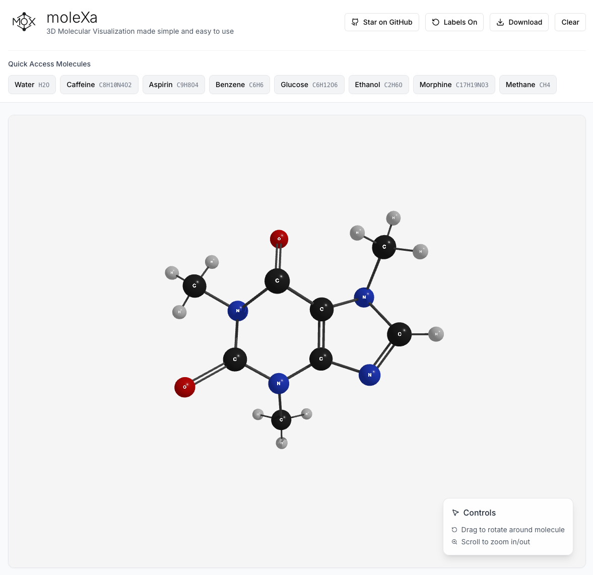

# moleXa - 3D Molecular Visualization

<div align="center">
  
  
  [](https://github.com/bazarkua/molexa/stargazers)
  [](https://opensource.org/licenses/MIT)
  [](https://nextjs.org/)
  [](https://www.typescriptlang.org/)
  [](https://threejs.org/)
</div>

## What is this?

moleXa is a modern web application for 3D molecular visualization that makes chemistry accessible and engaging. I built it because existing molecular viewers like molview might be too complex to use for beginners, also it requires to have pro subscription if you want to download 3D format object, and moleXa is completely free and doesn't require any account registration. It fetches real molecular data from PubChem and renders scientifically accurate 3D structures with educational explanations.

**Live Demo: [molexa.org](https://molexa.org)**

## Why I made this

I wanted to create something that's immediately usable and free in any web browser alongside with visualizing molecular structures in pretty 3D models with some useful information.

## Key Features

- **Interactive 3D visualization** - Rotate, zoom, and explore molecules with smooth WebGL rendering
- **Educational context** - Learn what molecular properties actually mean
- **Smart search** - Autocomplete suggestions and formula validation
- **Safety information** - Real toxicity data for lab safety education
- **Mobile-friendly** - Works great on phones and tablets
- **No installation** - Runs entirely in your web browser
- **Live data** - Always up-to-date information from PubChem

## Screenshots

### 3D Molecular Visualization

*Interactive 3D model of morphine showing accurate atomic positions and bond structures*

### Comprehensive Molecular Information

*Detailed molecular data with educational context and alternative names*

### Educational Property Explanations

*Molecular properties with explanations of what they mean for drug-like behavior*

### Smart Search Features

*Formula search with validation and common examples*


*Intelligent autocomplete for chemical names*

### Real-time Analytics

*Live analytics showing educational impact and usage patterns*

## Quick Start

```bash
# Clone the repository
git clone https://github.com/bazarkua/molexa.git
cd molexa

# Install dependencies
npm install

# Start development server
npm run dev

# Open http://localhost:3000 in your browser
```

## How to Use

1. **Search for molecules** - Use the search bar to find compounds by name or chemical formula
2. **Explore in 3D** - Drag to rotate, scroll to zoom, toggle labels on/off
3. **Learn the details** - Check the molecular information panel for properties and safety data
4. **Download results** - Export high-quality images or 3D models for presentations

## Tech Stack

- **Next.js 15** - React framework with server-side rendering
- **Three.js** - WebGL-based 3D graphics
- **TypeScript** - Type safety and better development experience
- **Tailwind CSS** - Utility-first styling
- **Zustand** - Lightweight state management
- **Radix UI** - Accessible component primitives

## Environment Setup

```bash
# Optional - for local API development
NEXT_PUBLIC_USE_LOCAL_API=true
```

The app automatically uses the production API at `molexa-api.vercel.app` unless you're running the backend locally.

## Development

```bash
# Start with hot reloading
npm run dev

# Build for production
npm run build

# Run production build
npm run start

# Type checking
npm run lint
```

## Educational Impact

I want this tool to be used by students and educators worldwide. The backend API tracks educational usage patterns to understand how molecular visualization supports learning. All tracking is privacy-focused and helps improve the educational experience.

## Related Projects

- **Backend API**: [molexa-api](https://github.com/bazarkua/molexa-api) - The educational proxy API that powers this frontend
- **Live Analytics**: [molexa-api.vercel.app](https://molexa-api.vercel.app) - Real-time usage analytics

## Contributing

I welcome contributions from educators, students, and developers. If you have ideas for making chemistry more accessible or find bugs, please open an issue or submit a pull request.

## Special Thanks
This project was developed with invaluable assistance from Claude AI by Anthropic.

## Citations

If you use moleXa in research, education, or publications, please cite:

**Frontend Application:**
```
Bazarkulov, A. (2025). moleXa: 3D Molecular Visualization Platform (Version 2.0.0) [Computer software]. 
GitHub. https://github.com/bazarkua/molexa
```

**Backend API:**
```
Bazarkulov, A. (2025). moleXa API: PubChem Educational Proxy API (Version 2.2.0) [Computer software]. 
GitHub. https://github.com/bazarkua/molexa-api
```

**PubChem Database:**
```
Kim, S., Chen, J., Cheng, T., et al. (2025). PubChem 2025 update. 
Nucleic Acids Research, 53(D1), D1516–D1525. https://doi.org/10.1093/nar/gkae1059
```

## License

MIT License - see [LICENSE](LICENSE) for details.

## Links

- **Live Application**: [molexa.org](https://molexa.org)
- **Backend API**: [molexa-api.vercel.app](https://molexa-api.vercel.app)
- **API Repository**: [github.com/bazarkua/molexa-api](https://github.com/bazarkua/molexa-api)
- **PubChem Database**: [pubchem.ncbi.nlm.nih.gov](https://pubchem.ncbi.nlm.nih.gov)

---

Built with passion and vision for accessible education.